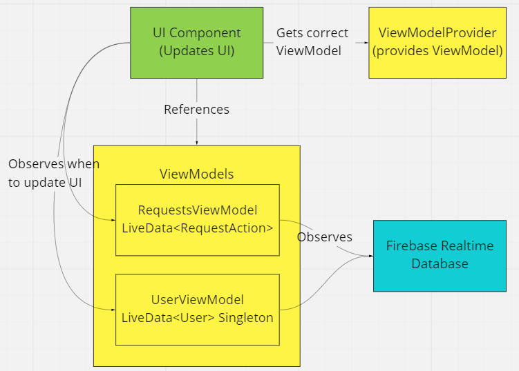

# Kampung

App that allows users to request for takeaway food or offer to takeaway food. The features include the following:

1)	Create requests: Users can input what food they want from nearby locations like Changi City Point, EastPoint Mall, Jewel, Simpang, Bedok Point or even from the SUTD canteen. Once this request has been created, it is stored in the Firebase database with a unique request ID.

2)	Browse Requests: All users can view all available requests in the home page. The requests created or accepted by the user can be viewed under the user profile page. 

3)	Filter Requests: If one is going to the aforementioned locations and is willing to help a hungry SUTD student out, then they can filter the requests by location to save time. They will be referred to as dabaoer. 

4)	Accept Requests: If one is going to the aforementioned locations and is willing to help a hungry SUTD student out, then they can accept the request and proceed to message the user who requested via Telegram to discuss when to drop off the food and what tips are expected in exchange. Once accepted, the request will not be displayed on the home page.

5)	Track Requests: Once the order has been delivered either the dabaoee or dabaoer can indicate that it has been delivered and it will be removed from the database.

## System Design and Implementation
We use Android Fragments to improve modularity, reusability and responsiveness of UI components. We use Android ViewModels to separate UI data ownership from UI controller logic.

### Android ViewModels
1.	Lifecycle-aware: Since ViewModel objects are scoped to the Lifecycle of its attached UI component, its data persists through device configuration changes only when UI is active, until the UI Lifecycle is destroyed.
2.	Asynchronous updates: Since data is updated asynchronously from Firebase, we abstract away management of asynchronous calls from UI controllers.
3.	Less bloat, ease of testing, low overhead: Reducing responsibility of UI controllers reduces bloat and improves ease of testing. As the UI lifecycle does not load data, there is less overhead.

### Data Persistence
The Android App uses the following services / APIs to save or retrieve data.
1.	Firebase Realtime Database: All user, order and request data is maintained, updated and read from Firebase Realtime Database. The cloud-hosted NoSQL database helps store and sync data between different users and removes the need for servers
2.	Android SharedPreferences: User preferred UI configurations are stored in local SharedPreferences, as they depend on the owner of the application, e.g. user details in the welcome page.

### MVC Pattern
As per figure 2, we define User, Order, Request models to store application data and define communication with the database and within the application. Controllers are defined with Fragment / Activity java files. They allow users to interact with application data. Views are defined with XML layouts, offering interaction for the user. The MVC pattern used ensures separation of concerns, easier testing especially for Model and Controller components. View components can be tested through UI tests. There are unit tests implemented for ViewModels in the ExampleUnitTests package.

### Observer Pattern
1.	UI component observes LiveData: LiveData instances observables. Their references are shared with UI components at runtime, decoupling one-to-many dependency between data and UI. Dependent UI components are updated automatically. LiveData respects the lifecycle of the UI component it is scoped to. This ensures that updates are done when the UI component is active, reducing overhead.
2.	ViewModel observes Firebase Realtime Database: ViewModels observe a Firebase Realtime Database instance. Event listeners are registered to the database reference on execution, decoupling ViewModels from the database layer.

### Singleton Pattern
1.	UserLiveData: The MutableLiveData reference in UserViewModel has a Singleton implementation. Using a private constructor and lazy instantiation, we ensure all references to the user instance are the same and updated.
2.	DAO: Maintains the single point of access to the database instance.

### Data Access Object (DAO) Pattern
DAO provides basic data operations to UI components without exposing low level details of the database. It keeps a reference to Firebase Realtime Database, provides add, update, remove for both values and listeners, isolating the UI layer from the persistence layer.

### Template Pattern
RequestDetailFragment: This template implements logic that updates the view based on request. Subclasses for Home and User variants implement concrete behavior for the button.

### Strategy, Adapter Pattern
We used Android RecyclerView to display requests. The recycler view uses a strategy pattern, delegating retrieving of data to the RequestAdapter object and managing the layout to LinearLayoutManager object. RequestAdapter converts from the Request data interface to a ViewHolder UI interface for the RecyclerView to manage.
